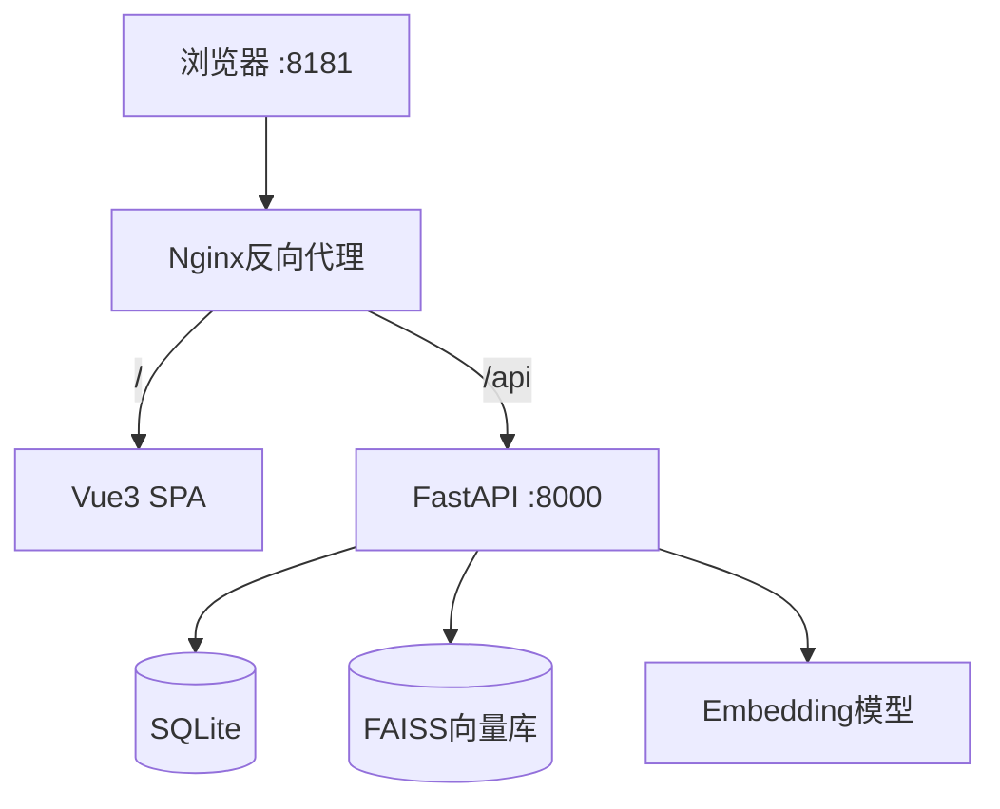
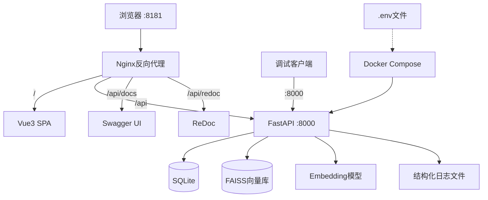

# 设计文档：AI知识库管理系统增强

## 概述

本设计文档描述了对现有AI知识库管理系统的十项增强。系统采用FastAPI后端 + Vue3前端 + Docker Compose部署架构。增强内容涵盖前端交互体验（Toast通知、上传进度、响应式布局、视觉层次）、后端健壮性（安全配置、错误处理、API文档、测试）以及部署运维（端口映射、数据卷管理、依赖文档）。

设计原则：
- 前端保持纯CSS方案，不引入UI框架
- 所有用户可见文本使用中文
- 保持现有Docker打包结构不变
- 增量修改，不破坏现有功能

## 架构

### 现有架构



### 增强后架构



关键变更：
1. Nginx新增/api/docs和/api/redoc路径转发
2. Docker Compose为后端添加外部端口映射（默认8000）
3. 敏感配置通过.env文件注入
4. 后端新增结构化JSON日志输出

## 组件与接口

### 1. Toast通知组件（前端）

新建 `frontend-admin/src/components/Toast.vue` 全局通知组件。

```vue
<!-- 接口设计 -->
<script>
// composable: useToast()
export function useToast() {
  function success(message: string): void    // 显示成功提示
  function error(message: string): void      // 显示错误提示
  function warning(message: string): void    // 显示警告提示
  function info(message: string): void       // 显示信息提示
}
</script>
```

实现方式：使用Vue3的provide/inject模式，在App.vue中注册全局Toast容器。每条消息包含id、type、message字段，3秒后自动移除。多条消息从顶部堆叠排列，使用CSS transition动画。

### 2. 上传进度组件（前端）

修改 `frontend-admin/src/views/Files.vue` 和 `frontend-admin/src/api/index.js`。

```javascript
// api/index.js 增强upload方法
export const files = {
  upload: (formData, onProgress) => api.post('/files/upload', formData, {
    onUploadProgress: (e) => onProgress(Math.round((e.loaded * 100) / e.total))
  }),
}
```

在Files.vue中添加上传状态区域，显示文件名和进度百分比条。上传完成或失败后通过Toast通知用户。

### 3. 响应式布局（前端）

修改 `frontend-admin/src/App.vue`，添加响应式断点：

| 视口宽度 | 侧边栏行为 | 内容区域 |
|----------|-----------|---------|
| ≥1024px | 完整显示（240px） | 正常布局 |
| 768-1024px | 收窄为图标模式（64px） | 自适应 |
| <768px | 隐藏，汉堡菜单触发覆盖层 | 全宽 |

实现方式：
- 使用CSS媒体查询 `@media` 实现断点
- 添加汉堡菜单按钮（仅移动端显示）
- 侧边栏覆盖层使用fixed定位 + 半透明背景
- 文件列表表格在移动端转为卡片布局（使用CSS `display: block` 技巧）

### 4. 视觉层次增强（前端）

修改各视图组件的样式：

- 页面头部区域：白色背景 + 底部阴影分隔
- 筛选/操作区域：浅灰背景（#f8fafc）+ 圆角容器
- 内容区域：白色卡片 + 边框
- Dashboard统计卡片：左侧4px彩色边框（蓝/绿/橙/紫对应不同指标）
- 文件管理操作按钮区域：独立白色容器 + 边框

### 5. 安全性增强（后端 + 部署）

修改 `backend/app/config.py`：

```python
import secrets

class Settings(BaseSettings):
    SECRET_KEY: str = ""  # 必须通过环境变量设置
    
    @validator('SECRET_KEY', pre=True, always=True)
    def set_secret_key(cls, v):
        if not v:
            import logging
            logging.getLogger(__name__).warning(
                "SECRET_KEY未设置，使用随机临时密钥。生产环境请配置SECRET_KEY环境变量。"
            )
            return secrets.token_urlsafe(32)
        return v
```

新建文件：
- `.env.example`：列出所有环境变量及说明
- 修改 `.gitignore`：添加 `.env`
- 修改 `docker-compose.yml`：添加 `env_file: ./.env`

### 6. API文档暴露（Nginx + 后端）

修改 `frontend-admin/nginx.conf`，添加Swagger和ReDoc路径转发：

```nginx
location /api/docs {
    proxy_pass http://backend:8000/docs;
    # ... proxy headers
}
location /api/openapi.json {
    proxy_pass http://backend:8000/openapi.json;
    # ... proxy headers
}
location /api/redoc {
    proxy_pass http://backend:8000/redoc;
    # ... proxy headers
}
```

修改后端各router，为每个端点添加中文summary/description和response_model。

### 7. 错误处理增强（后端 + 前端）

后端 - 修改 `backend/app/main.py`：

```python
# 全局异常处理器
@app.exception_handler(Exception)
async def global_exception_handler(request, exc):
    logger.error(f"Unhandled exception: {exc}", exc_info=True)
    return JSONResponse(
        status_code=500,
        content={"error_code": "INTERNAL_ERROR", "message": "服务器内部错误，请稍后重试"}
    )

@app.exception_handler(HTTPException)
async def http_exception_handler(request, exc):
    return JSONResponse(
        status_code=exc.status_code,
        content={"error_code": f"HTTP_{exc.status_code}", "message": exc.detail}
    )
```

后端 - 结构化日志配置：

```python
import logging
from logging.handlers import RotatingFileHandler
import json

class JSONFormatter(logging.Formatter):
    def format(self, record):
        return json.dumps({
            "timestamp": self.formatTime(record),
            "level": record.levelname,
            "logger": record.name,
            "message": record.getMessage(),
            "path": getattr(record, 'path', ''),
        }, ensure_ascii=False)
```

前端 - 修改 `frontend-admin/src/api/index.js`：

```javascript
// 响应拦截器
api.interceptors.response.use(
  response => response,
  error => {
    if (error.response?.status === 401) {
      localStorage.removeItem('token')
      window.location.href = '/login'
      // Toast: "登录已过期，请重新登录"
    }
    return Promise.reject(error)
  }
)
```

### 8. 测试框架（后端 + 前端）

后端测试结构：
```
backend/
  tests/
    conftest.py          # pytest fixtures（测试数据库、测试客户端）
    test_auth.py         # 认证模块单元测试
    test_files_api.py    # 文件API集成测试
    test_search_api.py   # 搜索API集成测试
    test_tag_generator.py # 标签生成器单元测试
  pytest.ini             # pytest配置
```

使用 `httpx.AsyncClient` + `pytest-asyncio` 进行FastAPI异步测试。测试数据库使用内存SQLite。

前端测试结构：
```
frontend-admin/
  src/__tests__/
    api.test.js          # API客户端拦截器测试
  vitest.config.js       # Vitest配置
```

### 9. Docker端口映射（部署）

修改 `docker-compose.yml`：

```yaml
services:
  backend:
    ports:
      - "${BACKEND_PORT:-8000}:8000"
```

通过环境变量 `BACKEND_PORT` 控制映射端口，默认8000。

### 10. 数据卷配置（部署）

当前数据卷 `kb-data` 挂载到 `/data`，内部目录结构：

```
/data/
  ├── knowledge.db        # SQLite数据库
  ├── uploads/            # 上传文件存储
  ├── vector_store/       # FAISS向量索引
  │   ├── faiss.index
  │   └── id_map.json
  └── Knowledge_Inbox/    # 文件收件箱
```

在docker-compose.yml中添加注释说明目录结构。在README.md中添加数据备份和恢复指南。

## 数据模型

现有数据模型无需修改。增强主要涉及：

### 错误响应模型（新增）

```python
from pydantic import BaseModel

class ErrorResponse(BaseModel):
    error_code: str       # 错误码，如 "INTERNAL_ERROR", "HTTP_401"
    message: str          # 用户友好的中文错误描述

class UploadResponse(BaseModel):
    uploaded: int         # 成功上传的文件数量
    files: list           # 上传文件详情列表

class FileListResponse(BaseModel):
    files: list           # 文件列表

class SearchResponse(BaseModel):
    query: str            # 搜索查询词
    results: list         # 搜索结果列表

class OverviewResponse(BaseModel):
    total_files: int
    completed: int
    pending_review: int
    approved: int
    by_bucket: dict
```

### Toast消息模型（前端）

```javascript
// Toast消息数据结构
{
  id: number,           // 唯一标识（时间戳）
  type: 'success' | 'error' | 'warning' | 'info',
  message: string,      // 中文提示文本
  duration: 3000        // 自动消失时间（毫秒）
}
```


## 正确性属性

*正确性属性是一种在系统所有有效执行中都应成立的特征或行为——本质上是关于系统应该做什么的形式化陈述。属性作为人类可读规范与机器可验证正确性保证之间的桥梁。*

### Property 1: 上传进度百分比计算正确性

*For any* 有效的已加载字节数(loaded)和总字节数(total)对（其中 total > 0 且 loaded >= 0 且 loaded <= total），计算出的进度百分比应等于 `Math.round((loaded * 100) / total)`，且结果在0到100之间。

**Validates: Requirements 1.1**

### Property 2: 操作完成后显示Toast通知

*For any* 系统操作（审核通过、审核拒绝、重建索引、处理待处理文件），操作完成后Toast消息列表中应包含一条与该操作对应的成功或失败类型的消息。

**Validates: Requirements 1.4**

### Property 3: Toast生命周期管理

*For any* 按顺序添加的N条Toast消息序列，消息列表应保持插入顺序，且每条消息在其持续时间（3秒）到期后应从活跃列表中移除。

**Validates: Requirements 1.5, 1.6**

### Property 4: SECRET_KEY环境变量读取

*For any* 非空字符串设置为SECRET_KEY环境变量，Settings实例的SECRET_KEY属性应等于该字符串。当环境变量未设置时，两次独立创建的Settings实例应产生不同的SECRET_KEY值（随机性）。

**Validates: Requirements 4.1, 4.2**

### Property 5: 前端依赖版本精确性

*For any* package.json中dependencies和devDependencies中的依赖版本字符串，该字符串不应以 `^` 或 `~` 字符开头。

**Validates: Requirements 5.2**

### Property 6: API文档完整性

*For any* FastAPI应用注册的API路由，其OpenAPI规范中应包含非空的summary字段，且responses中应定义至少一个响应模型的schema。

**Validates: Requirements 6.3, 6.4**

### Property 7: 搜索结果仅包含已审核文件

*For any* 包含混合审核状态文件的数据库，搜索API返回的所有结果中的文件应仅包含 `review_status == "approved"` 的文件。

**Validates: Requirements 7.3**

### Property 8: 标签生成器关键词匹配

*For any* 包含已知关键词（如"产品A"、"方案"、"销售"等）的文件名和内容组合，标签生成器生成的标签列表中应包含与该关键词匹配的标签条目。

**Validates: Requirements 7.4**

### Property 9: API请求拦截器Token注入

*For any* 存储在localStorage中的非空token字符串，API请求拦截器应在请求头中添加 `Authorization: Bearer {token}` 字段。当localStorage中无token时，请求头中不应包含Authorization字段。

**Validates: Requirements 7.5**

### Property 10: 全局异常处理器结构化响应

*For any* 后端未捕获的异常，全局异常处理器返回的JSON响应应包含 `error_code`（非空字符串）和 `message`（非空中文字符串）两个字段，且HTTP状态码为500。

**Validates: Requirements 8.1**

### Property 11: 结构化JSON日志格式

*For any* 后端写入的错误日志条目，该条目应为有效的JSON格式，且包含 `timestamp`、`level`、`logger` 和 `message` 四个必需字段。

**Validates: Requirements 8.2**

## 错误处理

### 后端错误处理策略

1. **全局异常处理器**：在FastAPI应用中注册 `Exception` 和 `HTTPException` 的全局处理器
   - 未捕获异常返回500状态码 + `{"error_code": "INTERNAL_ERROR", "message": "服务器内部错误"}`
   - HTTP异常保留原始状态码，格式化为统一JSON结构
   - 所有异常记录到结构化日志

2. **结构化日志**：使用自定义JSONFormatter
   - 日志文件路径：`/data/logs/app.log`
   - 使用RotatingFileHandler，单文件最大10MB，保留5个备份
   - 每条日志包含：timestamp、level、logger、message、path（请求路径）

3. **文件处理错误**：现有的try/catch机制保持不变，但错误信息通过ProcessLog记录并通过API返回给前端

### 前端错误处理策略

1. **响应拦截器**：在axios实例上注册响应拦截器
   - 401响应：清除token，跳转登录页，显示"登录已过期"Toast
   - 403响应：显示"权限不足"Toast
   - 500响应：显示"服务器错误，请稍后重试"Toast
   - 网络错误：显示"网络连接失败"Toast

2. **组件级错误处理**：各视图组件的catch块改为调用Toast通知，替代console.error

## 测试策略

### 测试框架选择

- **后端**：pytest + pytest-asyncio + httpx（FastAPI异步测试）
- **前端**：Vitest（与Vite生态集成）
- **属性测试**：后端使用 Hypothesis（Python属性测试库），前端使用 fast-check（JavaScript属性测试库）

### 后端测试

#### 单元测试
- `test_tag_generator.py`：测试标签生成、标准名生成、分类推荐
- `test_config.py`：测试环境变量读取和默认值行为

#### 集成测试
- `test_auth.py`：测试登录、token生成和验证、管理员初始化
- `test_files_api.py`：测试文件上传、列表查询、审核操作
- `test_search_api.py`：测试搜索结果仅返回已审核文件

#### 属性测试
- 每个属性测试最少运行100次迭代
- 每个属性测试必须用注释标注对应的设计文档属性编号
- 标注格式：**Feature: system-enhancement, Property {number}: {property_text}**
- 每个正确性属性由一个独立的属性测试实现

### 前端测试

#### 单元测试
- `api.test.js`：测试请求拦截器token注入、响应拦截器错误处理

#### 属性测试
- Toast组件生命周期测试（使用fast-check）
- 上传进度计算测试（使用fast-check）

### 测试配置

后端 `pytest.ini`：
```ini
[pytest]
asyncio_mode = auto
testpaths = tests
```

后端额外依赖：
```
pytest==7.4.4
pytest-asyncio==0.23.3
httpx==0.26.0
hypothesis==6.92.2
```

前端额外依赖：
```
vitest
@vue/test-utils
jsdom
fast-check
```
